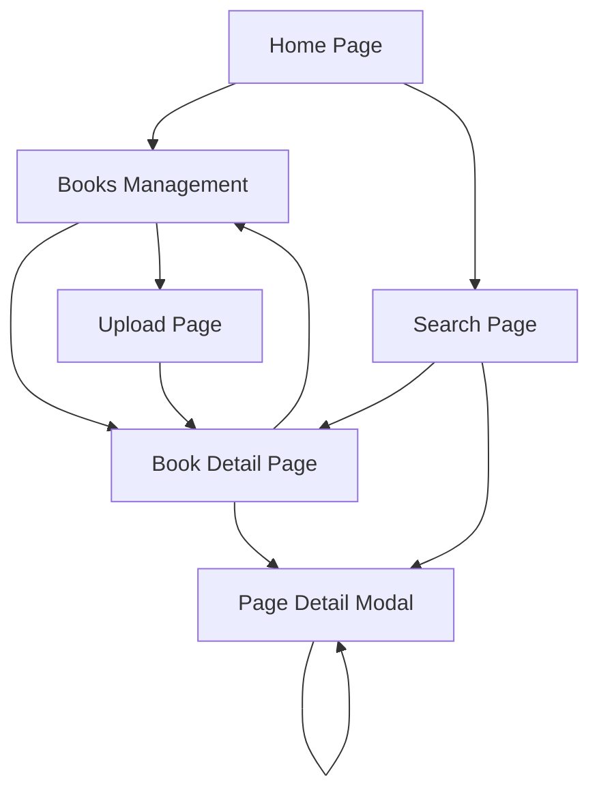

# Product Requirements Document

## Digital Book Processing & Translation System

### Version: v1.0
### Owner: Fikri Firdaus
### Date: September 2025

---

## 1. Product Overview

A comprehensive digital book processing and translation system that enables structured storage, semantic search, and multilingual translation management for digitized books. The system supports Arabic source texts with English and Indonesian translations, utilizing advanced embedding technology for intelligent content discovery.

The platform addresses the need for efficient book digitization workflows, semantic content analysis, and translation management, serving researchers, translators, and content managers who work with multilingual book collections.

## 2. Core Features

### 2.1 User Roles

| Role | Registration Method | Core Permissions |
|------|---------------------|------------------|
| Admin/User | Direct access (v1) | Full access to upload, manage, search, and translate books |

### 2.2 Feature Module

Our digital book processing system consists of the following main pages:

1. **Home Page**: hero section with system overview, quick search bar, recent books grid, and main navigation
2. **Books Management Page**: book library grid/list view, upload new book form, book metadata management
3. **Book Detail Page**: book cover and metadata display, pages list with navigation, translation status overview
4. **Page Detail Modal**: original text display, translation editing interface, embedding model information
5. **Search Page**: advanced semantic search interface, search results with snippets, filtering options
6. **Upload Page**: book metadata input form, cover image upload, bulk page text upload interface

### 2.3 Page Details

| Page Name | Module Name | Feature Description |
|-----------|-------------|---------------------|
| Home Page | Hero Section | Display system overview, key statistics, and quick access to main features |
| Home Page | Quick Search | Provide instant semantic search across all books with auto-suggestions |
| Home Page | Recent Books | Show grid of recently added books with covers and basic metadata |
| Home Page | Navigation | Main menu with access to all system sections |
| Books Management | Book Library | Display all books in grid/list format with sorting and filtering options |
| Books Management | Upload Form | Create new book entries with title, author, language, and cover image |
| Books Management | Book Actions | Edit, delete, and manage individual book settings |
| Book Detail | Book Header | Show book cover, title, author, language, and creation date |
| Book Detail | Pages List | Display all pages with page numbers, text previews, and translation status |
| Book Detail | Page Navigation | Navigate between pages with previous/next controls |
| Book Detail | Translation Overview | Show translation progress and available languages |
| Page Detail Modal | Original Text | Display full original text content with proper formatting |
| Page Detail Modal | Translation Editor | Edit English and Indonesian translations with save functionality |
| Page Detail Modal | Embedding Info | Show which embedding model was used and when |
| Page Detail Modal | Page Navigation | Move between pages within the modal interface |
| Search Page | Search Interface | Advanced search with query input, filters, and search options |
| Search Page | Results Display | Show search results with relevance scores, snippets, and highlighting |
| Search Page | Result Actions | Navigate to source pages, view context, and refine searches |
| Upload Page | Book Metadata | Input form for book title, author, language, and description |
| Upload Page | Cover Upload | Image upload interface with preview and validation |
| Upload Page | Bulk Text Upload | Upload multiple pages with automatic text processing and embedding generation |

## 3. Core Process

**Main User Flow:**

1. **Book Upload Process**: User uploads book metadata and cover image → adds pages with original text → system generates embeddings automatically → book becomes searchable

2. **Search and Discovery**: User enters search query → system generates query embedding → performs semantic similarity search → returns ranked results with snippets

3. **Translation Workflow**: User selects a page → views original text → adds/edits English or Indonesian translations → saves changes with version tracking

4. **Book Management**: User browses book library → selects book for detailed view → manages pages and translations → monitors translation progress

## 4. User Interface Design

### 4.1 Design Style

- **Primary Colors**: Deep blue (#1e40af) for headers and primary actions, warm gray (#6b7280) for secondary elements
- **Secondary Colors**: Green (#10b981) for success states, amber (#f59e0b) for warnings, red (#ef4444) for errors
- **Button Style**: Rounded corners (8px radius) with subtle shadows, hover states with color transitions
- **Typography**: Inter font family, 16px base size, 1.5 line height for readability
- **Layout Style**: Card-based design with clean spacing, top navigation with breadcrumbs, responsive grid layouts
- **Icons**: Heroicons for consistency, book and document themed icons, RTL language support icons

### 4.2 Page Design Overview

| Page Name | Module Name | UI Elements |
|-----------|-------------|-------------|
| Home Page | Hero Section | Large banner with gradient background, centered title, subtitle, and CTA button |
| Home Page | Quick Search | Prominent search bar with magnifying glass icon, auto-complete dropdown |
| Home Page | Recent Books | 3-column responsive grid, book cards with cover images, titles, and metadata |
| Books Management | Book Library | Filterable grid/list toggle, search bar, sort dropdown, pagination controls |
| Books Management | Upload Form | Multi-step form with progress indicator, drag-drop file upload, validation messages |
| Book Detail | Book Header | Two-column layout: cover image left, metadata right, action buttons below |
| Book Detail | Pages List | Table with page numbers, text previews, translation status badges, action buttons |
| Page Detail Modal | Content Area | Split-pane layout: original text left, translations right, tabbed interface |
| Search Page | Search Interface | Advanced search form with filters sidebar, query input with search history |
| Search Page | Results Display | List layout with result cards, relevance scores, highlighted snippets |
| Upload Page | Upload Interface | Step-by-step wizard with file validation, progress bars, preview panels |

### 4.3 Responsiveness

The application is designed with a desktop-first approach but fully responsive for tablet and mobile devices. Touch interactions are optimized for mobile users, with larger touch targets and swipe gestures for page navigation. The interface adapts to different screen sizes with collapsible navigation and stacked layouts on smaller screens.