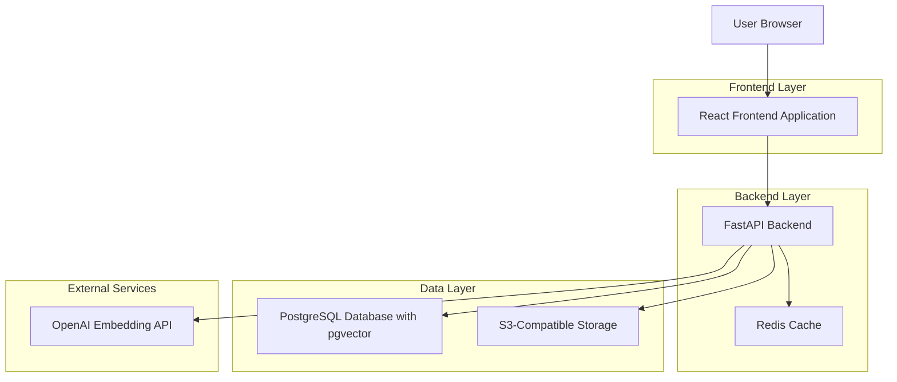
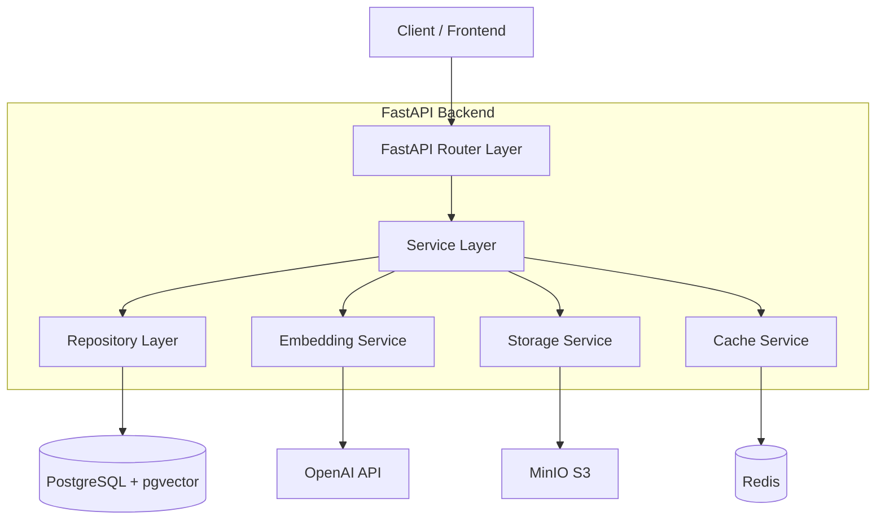
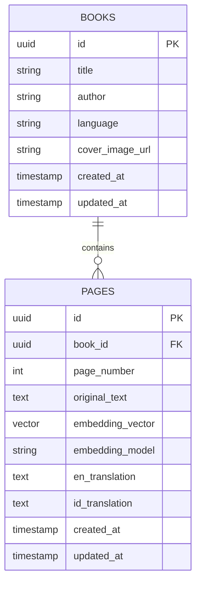

# Technical Architecture Document

## Digital Book Processing & Translation System

### Version: v1.0
### Date: September 2025

---

## 1. Architecture Design



## 2. Technology Description

- **Frontend**: React@18 + TypeScript + Tailwind CSS@3 + Vite
- **Backend**: FastAPI + Python 3.11 + SQLAlchemy + Alembic
- **Database**: PostgreSQL 15 + pgvector extension
- **Storage**: MinIO (S3-compatible) for cover images
- **Cache**: Redis for session and query caching
- **Embeddings**: OpenAI text-embedding-3-small API
- **Containerization**: Docker + Docker Compose

## 3. Route Definitions

| Route | Purpose |
|-------|----------|
| / | Home page with book grid and search functionality |
| /books | Books management page with upload and listing |
| /books/:id | Book detail page with pages and metadata |
| /books/:id/pages/:pageNumber | Individual page view with translations |
| /search | Advanced search page with semantic search results |
| /upload | Book and page upload interface |

## 4. API Definitions

### 4.1 Core API

**Books Management**

```
POST /api/books
```

Request:
| Param Name | Param Type | isRequired | Description |
|------------|------------|------------|-------------|
| title | string | true | Book title |
| author | string | false | Book author |
| language | string | true | Source language code (e.g., 'ar') |
| cover_image | File | false | Cover image file |

Response:
| Param Name | Param Type | Description |
|------------|------------|-------------|
| id | string | Book UUID |
| title | string | Book title |
| author | string | Book author |
| language | string | Language code |
| cover_image_url | string | S3 URL for cover image |
| created_at | string | ISO timestamp |

```
GET /api/books
```

Response:
| Param Name | Param Type | Description |
|------------|------------|-------------|
| books | Array<Book> | List of all books |
| total | number | Total count |

```
GET /api/books/{book_id}
```

Response:
| Param Name | Param Type | Description |
|------------|------------|-------------|
| id | string | Book UUID |
| title | string | Book title |
| pages_count | number | Total pages in book |
| metadata | object | Book metadata |

**Pages Management**

```
POST /api/books/{book_id}/pages
```

Request:
| Param Name | Param Type | isRequired | Description |
|------------|------------|------------|-------------|
| page_number | number | true | Page sequence number |
| original_text | string | true | Original text content |

Response:
| Param Name | Param Type | Description |
|------------|------------|-------------|
| id | string | Page UUID |
| page_number | number | Page number |
| embedding_model | string | Model used for embedding |

```
GET /api/books/{book_id}/pages
```

Response:
| Param Name | Param Type | Description |
|------------|------------|-------------|
| pages | Array<Page> | List of book pages |
| total | number | Total pages count |

```
PATCH /api/books/{book_id}/pages/{page_number}
```

Request:
| Param Name | Param Type | isRequired | Description |
|------------|------------|------------|-------------|
| en_translation | string | false | English translation |
| id_translation | string | false | Indonesian translation |

**Search API**

```
POST /api/search
```

Request:
| Param Name | Param Type | isRequired | Description |
|------------|------------|------------|-------------|
| query | string | true | Search query text |
| limit | number | false | Results limit (default: 10) |
| similarity_threshold | number | false | Minimum similarity score |

Response:
| Param Name | Param Type | Description |
|------------|------------|-------------|
| results | Array<SearchResult> | Matching pages with scores |
| query_embedding_model | string | Model used for query |

Example Request:
```json
{
  "title": "Al-Kitab Al-Muqaddas",
  "author": "Various",
  "language": "ar"
}
```

Example Response:
```json
{
  "id": "550e8400-e29b-41d4-a716-446655440000",
  "title": "Al-Kitab Al-Muqaddas",
  "author": "Various",
  "language": "ar",
  "cover_image_url": "https://storage.example.com/covers/550e8400.jpg",
  "created_at": "2025-09-01T10:00:00Z"
}
```

## 5. Server Architecture Diagram



## 6. Data Model

### 6.1 Data Model Definition



### 6.2 Data Definition Language

**Books Table**
```sql
-- Enable UUID extension
CREATE EXTENSION IF NOT EXISTS "uuid-ossp";

-- Enable pgvector extension
CREATE EXTENSION IF NOT EXISTS vector;

-- Create books table
CREATE TABLE books (
    id UUID PRIMARY KEY DEFAULT uuid_generate_v4(),
    title VARCHAR(500) NOT NULL,
    author VARCHAR(300),
    language VARCHAR(10) NOT NULL DEFAULT 'ar',
    cover_image_url TEXT,
    created_at TIMESTAMP WITH TIME ZONE DEFAULT NOW(),
    updated_at TIMESTAMP WITH TIME ZONE DEFAULT NOW()
);

-- Create indexes for books
CREATE INDEX idx_books_title ON books(title);
CREATE INDEX idx_books_author ON books(author);
CREATE INDEX idx_books_language ON books(language);
CREATE INDEX idx_books_created_at ON books(created_at DESC);
```

**Pages Table**
```sql
-- Create pages table
CREATE TABLE pages (
    id UUID PRIMARY KEY DEFAULT uuid_generate_v4(),
    book_id UUID NOT NULL REFERENCES books(id) ON DELETE CASCADE,
    page_number INTEGER NOT NULL,
    original_text TEXT NOT NULL,
    embedding_vector vector(1536), -- OpenAI text-embedding-3-small dimension
    embedding_model VARCHAR(100) NOT NULL DEFAULT 'text-embedding-3-small',
    en_translation TEXT,
    id_translation TEXT,
    created_at TIMESTAMP WITH TIME ZONE DEFAULT NOW(),
    updated_at TIMESTAMP WITH TIME ZONE DEFAULT NOW(),
    UNIQUE(book_id, page_number)
);

-- Create indexes for pages
CREATE INDEX idx_pages_book_id ON pages(book_id);
CREATE INDEX idx_pages_page_number ON pages(page_number);
CREATE INDEX idx_pages_embedding_model ON pages(embedding_model);
CREATE INDEX idx_pages_created_at ON pages(created_at DESC);

-- Create vector similarity index for semantic search
CREATE INDEX idx_pages_embedding_vector ON pages 
USING ivfflat (embedding_vector vector_cosine_ops) 
WITH (lists = 100);
```

**Triggers for updated_at**
```sql
-- Function to update updated_at timestamp
CREATE OR REPLACE FUNCTION update_updated_at_column()
RETURNS TRIGGER AS $$
BEGIN
    NEW.updated_at = NOW();
    RETURN NEW;
END;
$$ language 'plpgsql';

-- Triggers for books table
CREATE TRIGGER update_books_updated_at 
    BEFORE UPDATE ON books 
    FOR EACH ROW 
    EXECUTE FUNCTION update_updated_at_column();

-- Triggers for pages table
CREATE TRIGGER update_pages_updated_at 
    BEFORE UPDATE ON pages 
    FOR EACH ROW 
    EXECUTE FUNCTION update_updated_at_column();
```

**Initial Data**
```sql
-- Insert sample book
INSERT INTO books (title, author, language) VALUES 
('Sample Arabic Book', 'Sample Author', 'ar');

-- Insert sample pages (embedding_vector would be populated by the application)
INSERT INTO pages (book_id, page_number, original_text, embedding_model) 
SELECT 
    id, 
    1, 
    'هذا نص تجريبي باللغة العربية للصفحة الأولى من الكتاب', 
    'text-embedding-3-small'
FROM books 
WHERE title = 'Sample Arabic Book';
```